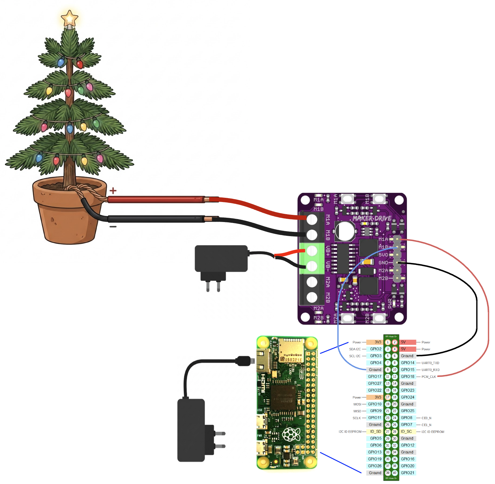

# Raspberry Pi GPIO Light Tree

A small Rust server that controls a low-voltage light tree with Raspberry Pi
hardware PWM. The included React web interface supports direct brightness
control and an MP3 playlist that pulses the lights using browser-side drum
onset detection.

## Hardware

- Raspberry Pi (the original setup uses a Pi Zero-class board)
- [Cytron Maker Drive](https://www.cytron.io/p-maker-drive-simplifying-h-bridge-motor-driver-for-beginner)
- Low-voltage DC tree lights
- External power supply suitable for the lights
- Jumper wires

The server uses `rppal::pwm::Channel::Pwm0` at 1 kHz. With the default
`pwm-2chan` overlay on older Raspberry Pi models, PWM0 is available on BCM
GPIO18, physical header pin 12.

## Connection diagram

The diagram uses channel 1 of the Maker Drive. `M1A input` and `M1A output`
are different connections on the board even though they have the same label.



```text
 Raspberry Pi                         Cytron Maker Drive
 40-pin header

 GPIO18 / PWM0 (pin 12)  ----------> M1A input
 GND (for example pin 14) ----------> GND
                                      M1B input ----------> GND

 External DC supply +  ------------> VB+
 External DC supply -  ------------> VB-
                                      |
                                      +---- GND shared with Raspberry Pi

 Maker Drive M1A output  ----------> Tree light +
 Maker Drive M1B output  ----------> Tree light -
```

Power the Raspberry Pi through its normal power input. Do **not** power it from
the Maker Drive `5VO` pin; that output is limited to 200 mA. The Pi and Maker
Drive must share ground so that the PWM logic level has a common reference.

The Maker Drive accepts 3.3 V logic, but its load supply is limited to
2.5–9.5 V, 1 A continuous, and 1.5 A peak for less than five seconds. Use only
low-voltage DC lights within those limits. The board does not regulate LED
current, so bare LEDs require a suitable resistor or constant-current circuit.
Never connect mains-powered lights to this circuit.

## Enable hardware PWM

Add this line to `/boot/firmware/config.txt`:

```text
dtoverlay=pwm-2chan
```

Then reboot:

```sh
sudo reboot
```

The default GPIO mapping differs on Raspberry Pi 5. Confirm its PWM channel
mapping and update the channel or overlay parameters before wiring it.

## Build and deploy

The default target is `aarch64-unknown-linux-musl` and the Rust build uses
`cross`.

```sh
# Build the single-file web interface.
make html

# Cross-compile the Rust server.
make rust

# Create dist/gpio_lighttree-aarch64-unknown-linux-musl.tgz.
make package

# Build, package, and upload with scp.
make upload TARGET_HOST=pi@raspberrypi.local REMOTE_PATH=/home/pi/
```

On the Raspberry Pi, extract the package and run it from the extracted
directory so it can find `static/index.html`:

```sh
tar -xzf gpio_lighttree-aarch64-unknown-linux-musl.tgz
cd gpio_lighttree
sudo ./gpio_lighttree
```

Open `http://<raspberry-pi-address>:3000/` in a browser. Use the **Manual** tab
for direct brightness control or the **Music** tab to add MP3 files and adjust
the drum-response parameters. Audio files remain in the browser and are not
uploaded to the Raspberry Pi.

## References

- [Maker Drive product page](https://www.cytron.io/p-maker-drive-simplifying-h-bridge-motor-driver-for-beginner)
- [Maker Drive datasheet](https://docs.google.com/document/d/1XakJWz9DAtrMc_Jf75FnDXs4gwT_osCSj3Rbx1OU7bM/view)
- [`rppal` PWM documentation](https://docs.rs/rppal/latest/rppal/pwm/)
- [Maker Drive connection image](https://shop.pimoroni.com/cdn/shop/products/makerdriveconnection-800x800_1500x1500_crop_center.jpg?v=1669393637)
- [Raspberry Pi pinout image](https://i.sstatic.net/yHddo.png)
